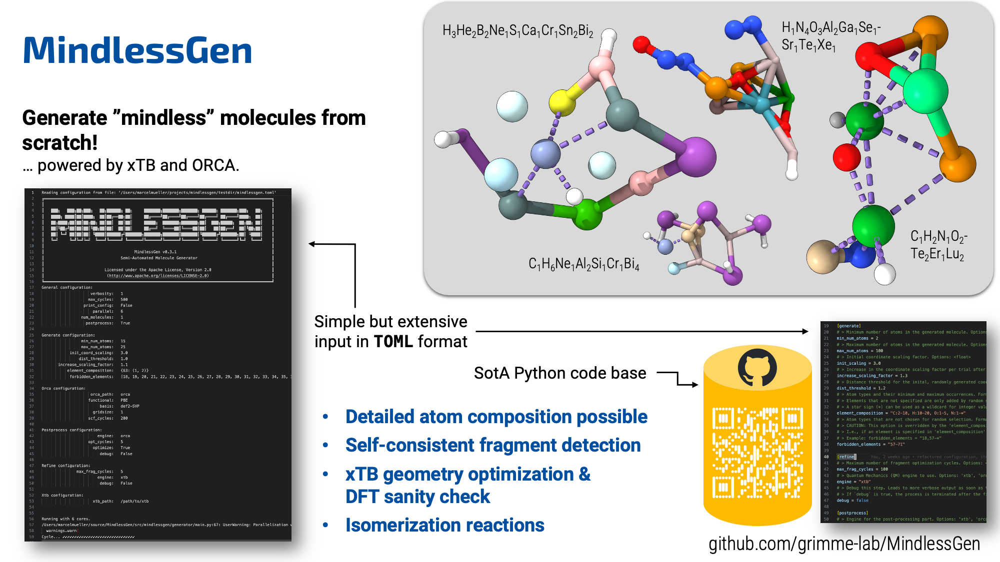

# Mindless Molecule Generator


<a href="http://www.apache.org/licenses/LICENSE-2.0">
  
</a>
<a href="https://img.shields.io/badge/Python-3.10%20|%203.11%20|%203.12%20|%203.13-blue.svg">
  
</a>


`mindlessgen` is a Python-based program for semi-automated generation of "mindless" small molecules, as described [here](https://pubs.acs.org/doi/full/10.1021/ct800511q).
The rule-based algorithm places atoms randomly in coordinate space and applies several optimization, fragment detection, and sanity check steps.
The program is mainly controlled via a [TOML](https://github.com/grimme-lab/MindlessGen/blob/main/mindlessgen.toml) configuration file, see below for details.

## One-page overview



## Installation

> [!IMPORTANT]
> `xtb` (see [here](https://github.com/grimme-lab/xtb)) has to be installed on your system, either via `conda-forge`, as a release binary, or compiled from source.
If post-processing with DFT is desired, also `orca` (see [here](https://www.faccts.de/docs/orca/6.0/manual/index.html)) has to be available.

### Non-development purposes

You can install the project in an existing virtual environment (provided for example by the package managers `conda` or `mamba` (see also [here](https://github.com/conda-forge/miniforge) and [here](https://conda.io/projects/conda/en/latest/user-guide/getting-started.html))).
With `mamba`, a matching Python environment can be set up and activated as follows:
```
mamba create -n mindlessgen python=3.12
mamba activate mindlessgen
```

Afterwards, the package can be installed by downloading the package from `PyPi`:
```bash
pip install mindlessgen
```
This command installs the latest release version of `mindlessgen`.

Alternatively, it can be installed from the latest source code via cloning the repository:
```bash
git clone https://github.com/grimme-lab/MindlessGen.git # or the analogous SSH link
pip install .
```

Both installation methods work in principle also without a virtual environment, but it is strongly recommended to use one to avoid conflicts with other packages.

### Development purposes

For working on the code of `mindlessgen`, the following setup is recommended:
```bash
mamba create -n mindlessgen python=3.12
mamba activate mindlessgen
git clone https://github.com/grimme-lab/MindlessGen.git # or the analogous SSH link
pip install -e '.[dev]'
```
Thereby, all necessary development tools (e.g., `ruff`, `mypy`, `tox`, `pytest`, and `pre-commit`) are installed.
Before making changes to the code, activate the `pre-commit` hooks via:
```
pre-commit install
```
Before pushing a commit, run the optional tests, which depend on external dependencies like `xtb`, via
```
pytest -vv --optional
```
Further information on how to contribute to this project can also be found in the [contribution guidelines](https://github.com/grimme-lab/MindlessGen/blob/main/CONTRIBUTING.md).

## Usage

### Command line interface

> [!WARNING]
> `mindlessgen` may still be subject to API changes.

`mindlessgen` can be executed after installation in the desired environment via:
```
mindlessgen -h
```
This command displays all command line options in the terminal.
In addition, all commands are accessible via the [TOML](https://github.com/grimme-lab/MindlessGen/blob/main/mindlessgen.toml) configuration file.
The template configuration file in the root directory of the repository contains comprehensive explanations for each of the available configuration keys.
If the path is not specified with `-c/--config`, `mindlessgen.toml` will be searched in the following locations, in order:
1. Current working directory (`$CWD`)
2. Home directory (`$USER/`)

If neither a corresponding CLI command nor an entry in the configuration file is provided, the default values are used.
The active configuration, including the default values, can be printed using `--print-config`.

#### Element composition
There are two related aspects of the element composition:
1. **Which elements** should occur within the generated molecule?
2. **How many atoms** of the specified element should occur?
- **Example 1**: `C:1-3, O:1-1, H:1-*` would result in a molecule with 1, 2, or 3 carbon atoms, exactly 1 oxygen atom, and between 1 and an undefined number of hydrogen atoms (i.e., at least 1).
- **Example 2**: `Na:10-10, In:10-10, O:20-20`. This example would result in a molecule with exactly 10 sodium atoms, 10 indium atoms, and 20 oxygen atoms.
For fixing the whole molecule to this composition, set `fixed_composition` to `true`.
`mindlessgen` will consequently always return a molecule with exactly 40 atoms.

> [!WARNING]
> When using `orca` and specifying elements with `Z > 86`, ensure that the basis set you've selected is compatible with (super-)heavy elements like actinides.
> You can find a list of available basis sets [here](https://www.faccts.de/docs/orca/6.0/manual/contents/detailed/basisset.html#built-in-basis-sets).
> A reliable standard choice that covers the entire periodic table is `def2-mTZVPP`.

### Python application programming interface

```python
"""
Python script that calls the MindlessGen API.
"""

import warnings

from mindlessgen.generator import generator
from mindlessgen.prog import ConfigManager


def main():
    """
    Main function for execution of MindlessGen via Python API.
    """
    config = ConfigManager()

    # General settings
    config.general.max_cycles = 500
    config.general.parallel = 6
    config.general.verbosity = -1
    config.general.num_molecules = 2
    config.general.postprocess = False
    config.general.write_xyz = False

    # Settings for the random molecule generation
    config.generate.min_num_atoms = 10
    config.generate.max_num_atoms = 15
    config.generate.element_composition = "Ce:1-1"
    # alternatively as a dictionary: config.generate.element_composition = {39:(1,1)}
    config.generate.forbidden_elements = "21-30,39-48,57-80"
    # alternatively as a list: config.generate.forbidden_elements = [20,21,22,23] # 24,25,26...

    # xtb-related settings
    config.xtb.level = 1

    try:
        molecules, exitcode = generator(config)
    except RuntimeError as e:
        print(f"\nGeneration failed: {e}")
        raise RuntimeError("Generation failed.") from e
    if exitcode != 0:
        warnings.warn("Generation completed with errors for parts of the generation.")
    for molecule in molecules:
        molecule.write_xyz_to_file()
        print(
            "\n###############\nProperties of molecule "
            + f"'{molecule.name}' with formula {molecule.sum_formula()}:"
        )
        print(molecule)


if __name__ == "__main__":
    main()
```

## Citation

When using the program for academic purposes, please cite _i)_ the original idea and _ii)_ the new Python implementation.

1.  _J. Chem. Theory Comput._ 2009, **5**, 4, 993–1003
    ```
    @article{korth_mindless_2009,
    	title = {Mindless {DFT} benchmarking},
    	volume = {5},
    	issn = {15499618},
    	url = {https://pubs.acs.org/doi/full/10.1021/ct800511q},
    	doi = {10.1021/ct800511q},
    	number = {4},
    	urldate = {2022-11-07},
    	journal = {J. Chem. Theo. Comp.},
    	author = {Korth, Martin and Grimme, Stefan},
    	month = apr,
    	year = {2009},
    	note = {Publisher: American Chemical Society},
    	pages = {993--1003},
    }
    ```

2.  A new publication featuring all functionalities and improvements of `mindlessgen` is in preparation.
    In the meantime, please refer to the original publication and to the following publication, which uses the `mindlessgen` program for the first time:
    Marcel Müller, Thomas Froitzheim, Andreas Hansen, and Stefan Grimme, *The Journal of Physical Chemistry A* **2024** *128* (49), 10723-10736, DOI: 10.1021/acs.jpca.4c06989.
    ```
    @article{
        doi:10.1021/acs.jpca.4c06989,
        author = {M{\"u}ller, Marcel and Froitzheim, Thomas and Hansen, Andreas and Grimme, Stefan},
        title = {Advanced Charge Extended Hückel (CEH) Model and a Consistent Adaptive Minimal Basis Set for the Elements Z = 1–103},
        journal = {The Journal of Physical Chemistry A},
        volume = {128},
        number = {49},
        pages = {10723-10736},
        year = {2024},
        doi = {10.1021/acs.jpca.4c06989},
        note ={PMID: 39621818},
        URL = {https://doi.org/10.1021/acs.jpca.4c06989},
        eprint = {https://doi.org/10.1021/acs.jpca.4c06989}
    }
    ```

## Acknowledgements

[T. Gasevic](https://github.com/gasevic) for creating an initial `GitHub` [migration](https://github.com/gasevic/mlmgen) of the code and making important adjustments to the workflow.
[S. Grimme](https://www.chemie.uni-bonn.de/grimme/de/grimme) and M. Korth for the original code written in Fortran associated to the publication in [J. Chem. Theory Comput.](https://pubs.acs.org/doi/full/10.1021/ct800511q).
[T. Froitzheim](https://github.com/thfroitzheim) for helpful discussons during the development of the program.
